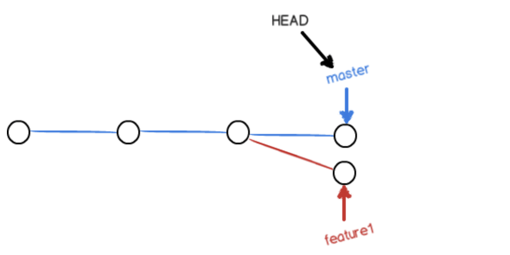

# Git

记录一下git操作

[TOC]


## 1.安装git

- terminal输入

  ```bash
  $ git
  ```

  

- 查看是否安装，如未安装可以用brew来安装（homebrew也需安装）

  ```bash
  $ brew intall git
  ```

  

## 2.创建ssh key、配置git

### (1)设置user.name和email(GitHub上每次commit可以看到)，比如


```bash
$  git config --global user.name "输入你的用户名"
$  git config --global user.email "输入你的邮箱"
```


初始化git仓库

### (2)创建ssh key

```bash
$ ssh-keygen -t rsa -C "comment"
```

这里的comment就只是一个注释，并没有什么用，只是用来识别，比如我的`id_rsa.pub`文件最后一行：

```bash
sUdLr6LG26QIBR6fwl9Z9YPyfqXtazoARbDggGO8wCI36a7cPG+7A3INfGfZHeU/JhNJfAc= smqsGitHub
```


更多可以参考[ssh-keygen 基本用法](https://www.liaohuqiu.net/cn/posts/ssh-keygen-abc/)和[ssh-keygen 参数说明](https://www.iteye.com/blog/killer-jok-1853451)

`-f`选项指定文件名，`-c`选项是公钥文件中的备注。

### (3)ssh key的密码

在创建时会询问保存路径和密码，按回车默认在~/.ssh下和无密码，否则在push时会要求密码


​		清除密码，会提示选择修改的密钥，回车默认是~/.ssh/id_rsa

```bash
$ ssh-keygen -p
```

### (4)把密钥key添加到GitHub的SSH设置中

```bash
$ pbcopy < ~/.ssh/id_rsa.pub #添加到剪贴板中
```


验证是否成功：

```bash
$ ssh -T git@github.com

结果：
Hi scuasmq! You've successfully authenticated, but GitHub does not provide shell access.
```

### (5)初始化git

先创建一个文件夹，然后到文件夹目录下

```bash
$ git init
```

### (6)关联、上传

```bash
#关联远程仓库，地址可以在仓库首页clone那儿看到，这里选择SSH
$ git remote add origin git@github.com:scuasmq/Algorithm.git

#若提交过会报错
>>>fatal: remote origin already exists.

#那么删除后再添加
$ git remote rm origin

#获取当前仓库状态
$ git status

#跟踪文件，.代表所有文件
$ git add <文件名> 

#将文件提交到本地仓库，-m选项提供描述
$ git commit -m "comment"

#上传
$ git push -u origin master
```

## 3.git常用指令

### 查看状态

```bash
 git status

#status 是指本地的状态，显示的是本地工作空间与本地仓库（或暂存区）之间的差异
#你新建的文件、修改但没提交(commit)的文件，都显示在这里，提交之后就是空的了
#pull/push 是本地仓库与远端仓库的同步操作，up-to-date 说明本地仓库与远端仓库是同步的
```


### 查看修改

```bash
$ git diff <file>
#显示的格式正是Unix通用的diff格式，比较的是工作区文件和暂存区/版本库中的文件，若已经add或commit,则相同
(base) bogon:algorithm asmqsaccount$ git diff README.md
diff --git a/README.md b/README.md
index 696a9de..31e6ef0 100644
--- a/README.md
+++ b/README.md
@@ -1,2 +1,2 @@
 Git is a distributed version control system
-Git is free software distributed under the GPL.
+Git is free software.
```


### 版本回退

```bash
#查看历史记录,显示从最近到最远的提交日志
$ git log [--pretty=oneline]

commit + Id
Auther: name + <email>
Date:

#在git中,HEAD表示当前版本，HEAD^表示上一个,HEAD^^上上个，HEAD~100上一百个
$ git reset --hard HEAD^
#可以看到工作区里的文件已经恢复

#再次使用git log,已经看不到之前的最新版本，但是可以通过terminal的历史记录来查看其commitId，输入前几位就可以自动查找,回到未来的版本
$ git reset --hard a5ab17a

#reflog查看每一次命令
$ git reflog

a5ab17a (HEAD -> master) HEAD@{0}: reset: moving to a5ab17a
d69c12a HEAD@{1}: reset: moving to HEAD^
a5ab17a (HEAD -> master) HEAD@{2}: commit: append GPL
d69c12a HEAD@{3}: commit: first
3885fd5 HEAD@{4}: commit: first
0fe05a7 (origin/master) HEAD@{5}: commit (initial): first commit
```


### 撤销修改

```bash
#保存到了暂存区，撤销保存
$ git restore --staged <file>

#保存到了暂存区后又做了修改，撤销对工作区的修改到与暂存区一致
#保存到了版本库后做了修改，还未保存到暂存区，撤销到对工作区的修改到与版本库一致
$ git checkout -- <file>
#或
$ git restore <file>
```


### 撤销删除

```bash
$ rm file
$ git rm file

#误删 rm file，两条指令都可以复原
$ git restore file
$ git checkout file
```


### 远程仓库

```bash
#由于远程库是空的，我们第一次推送master分支时，加上了-u参数，Git不但会把本地的master分支内容推送的远程新的master分支，还会把本地的master分支和远程的master分支关联起来，在以后的推送或者拉取时就可以简化命令。
$ git push -u origin master

#克隆时,ssh协议会更快
$ git clone ssh
```


### 分支管理

#### 分支的创建、切换与合并


```bash
#创建并切换分支
$ git branch file
$ git checkout file

or:
$ git checkout -b file   #加上-b表示创建并切换
or:
$ git switch -c file

#查看当前分支
$ git branch

#在branch分支下修改file，追踪提交后切换回master，发现没有改变
$ git checkout master
$ vim file

#合并分支，这里的Fast-forward表示这次合并是“快进模式”，也就是直接把master指向dev的当前提交，所以合并速度非常快。
$ git merge file

更新 1114b82..7e0f697
Fast-forward
 README.md | 1 +
 1 file changed, 1 insertion(+)
 
 #删除分支，合并完成后就可以删除
$ git branch -d dev
 
```


#### 解决冲突



```bash
#比如在feature1和master结尾处都加一不同的句子，然后add、commit，在merge时会出现冲突
$ git merge feature1
自动合并 README.md
冲突（内容）：合并冲突于 README.md
自动合并失败，修正冲突然后提交修正的结果。

#查看状态，可以发现冲突所在的地方
$ git status
您有尚未合并的路径。
  （解决冲突并运行 "git commit"）
  （使用 "git merge --abort" 终止合并）

未合并的路径：
  （使用 "git add <文件>..." 标记解决方案）
	双方修改：   README.md

#查看文件，可以看到冲突的分支内容已经被标记上了
$ vim file
......
<<<<<<< HEAD
Creating a new branch is quick & simple.
=======
Creating a new branch is quick AND simple.
>>>>>>> feature1

#手动合并后就可以提交

#使用带参数的git log，查看分支的合并情况
$ git log --graph --pretty=oneline --abbrev-commit

#最后删除feature1分支
$ git branch -d feature1
```

 


#### 分支管理策略

通常，合并分支时，如果可能，Git会用`Fast forward`模式，但这种模式下，删除分支后，会丢掉分支信息。

如果要强制禁用`Fast forward`模式，Git就会在merge时生成一个新的commit，这样，从分支历史上就可以看出分支信息。

下面我们试一下`--no-ff`方式的`git merge`：

```bash
$ git merge --no-ff -m "merge with no-ff" dev
```
上一小节的dev是没有出现在分支里的，这次结果如下图所示：


#### bug分支

git分支切换时，若b1和master的<font color = #ff00ff>版本仓库</font>一样，那么它们工作区、stage都一样，比如在切换到b1下，进行工作区的修改、add、new file之类的操作（除了commit）那么切换回master时都会保存。

若b1和master的<font color = #ff00ff>版本仓库</font>不一样，工作区或stage没有commit的时候，是不能切换的，那么问题来了。

软件开发中，bug就像家常便饭一样。有了bug就需要修复，在Git中，由于分支是如此的强大，所以，每个bug都可以通过一个新的临时分支来修复，修复后，合并分支，然后将临时分支删除。

在修复一个代号为101的bug时，想创建一个<font color = #ff000>`issue-101`</font> 来修复它，但是当前正在<font color = #ff0000>`dev`</font>上的工作只进行到一半，无法提交，但是又必须修复bug。

这时就可以用<font color = #ff0000>`stash`</font>命令，可以把工作现场“储藏”起来，等以后恢复现场继续工作。

```bash
$ git stash

#查看状态，可以看到工作区是干净的
$ git status
```

首先确定要在哪个分支上修复bug，假定需要在<font color = #ff0000>`master`</font>分支上修复，就从<font color = #ff0000>`master`</font>创建临时分支。

```bash
$ git checkout master
$ git checkout -b issue-101

#修复bug，commit，切换回master，合并，删除issuee-101分支
$ git switch master
$ git merge --no-ff -m "merged bug fix 101" issue-101

#回到dev分支干活，git stash list查看，git stash apply恢复，stash drop删，stash pop恢复并删除
$ git stash apply stash@{0}

#在dev分支上修复bug，将issue-101提交的修改，(提交时会有commitId)复制到dev分支就可以了
$ git cherry-pick 4c805e2
```


#### feature分支

添加功能时，为了不把主功能搞乱，新建一个feature分支，开发、完成、合并、删除。

```bash
$ git switch -c feature-dosth
$ git add dosth.py
$ git commit -m "add feature dosomething"

#切换回dev，合并
$ git switch dev
$ git merge --no-ff -m "add feature-dosomething to dev"
$ git branch -d feature-dosth

#没有合并但废弃了该分支，此时删除需要大写D
$ git branch -D feature-dosth
```


#### 多人协作

远程仓库的默认名称是<font color = #ff0000>`origin`</font>,查看远程库的信息：

```bash
$ git remote -v
origin	git@github.com:scuasmq/Algorithm.git (fetch)
origin	git@github.com:scuasmq/Algorithm.git (push)
```

推送分支

```bash
#git push 远程库 本地分支
$ git push origin master

#两个人同时push时，会提示冲突，此时先pull试图合并，解决冲突，再push
$ git pull
$ git diff <filename>
#解决冲突
```

抓取分支

```bash
#克隆
$ git clone ssh

#默认情况下本地只有master分支,获取远程分支
$ git checkout -b dev origin/dev

#若没有关联，则
$ git branch --set-upstream-to dev origin/dev
```


#### Rebase

多人在同一个分支上协作时，很容易出现冲突。即使没有冲突，后push的童鞋不得不先pull，在本地合并，然后才能push成功。

这样导致分支树乱，最终的分支树其实只要每个人的最终的push就可以了。

```bash
#push前
$ git rebase
```

#### 查看绑定仓库

```bash
$ git remote -v
```


#### 重新绑定仓库

```bash
$ git remote set-url
```


## 4.标签管理

tag就是commitId的别名，相当于一个指针

#### 创建标签

```bash
#切换到对应分支
$ git tag <name>

#为具体的commitId创建标签
$ git tag v0.9 commitId

#查看所有标签
$ git tag

#查看标签信息
$ git show <tagname>

#创建带有说明的标签，用-a指定标签名，-m指定说明文字
$ git tag -a v0.1 -m "comment" commitId

#标签总是和某个commit挂钩。如果这个commit既出现在master分支，又出现在dev分支，那么在这两个分支上都可以看到这个标签。
```


#### 标签操作

```bash
#删除标签,因为创建的标签都只存储在本地，不会自动推送到远程。所以，打错的标签可以在本地安全删除。
$ git tag -d v0.1

#推送某个标签到远程
$ git push origin <tagname>

#一次性推送全部尚未推送到远程的本地标签
$ git push origin --tags

#如果标签已经推送到远程，要删除
$ git tag -d tagname #删除本地
$ git push origin :refs/tags/<tagname>
```


## 5.其他

### 忽略.DS_Store文件

.DS_Store 是文件 Finder 用来存储这个文件夹的显示属性的：比如文件图标的摆放位置。删除以后的副作用就是这些信息的失去。

每次提交代码时，我都要在代码仓库的.gitignore中声明，忽略这类文件。有方法可以全局性的忽略某种类型的文件吗？

可以按以下步骤

```bash
vim ~/.gitignore_global
# .gitignore_global
######## OS generated files ########
.DS_Store
.DS_Store?
*.swp
._*
.Spotlight-V100
.Trashes
Icon?
ehthumbs.db
Thumbs.db
############# Packages #############
*.7z
*.dmg
*.gz
*.iso
*.jar
*.rar
*.tar
*.zip
------------------------------------------------------------------------------------------------
#在~/.gitconfig中引入.gitignore_global，加入如下一行
[core]
     excludesfile = /Users/asmqsaccount/.gitignore_global
```


### git教程

[廖雪峰](https://www.liaoxuefeng.com/wiki/896043488029600)

### 识别中文

```bash
$ git config --global core.quotepath false
#core.quotepath设为false的话，就不会对0x80以上的字符进行quote。
```

