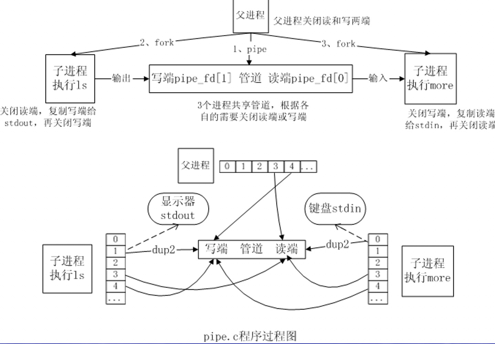
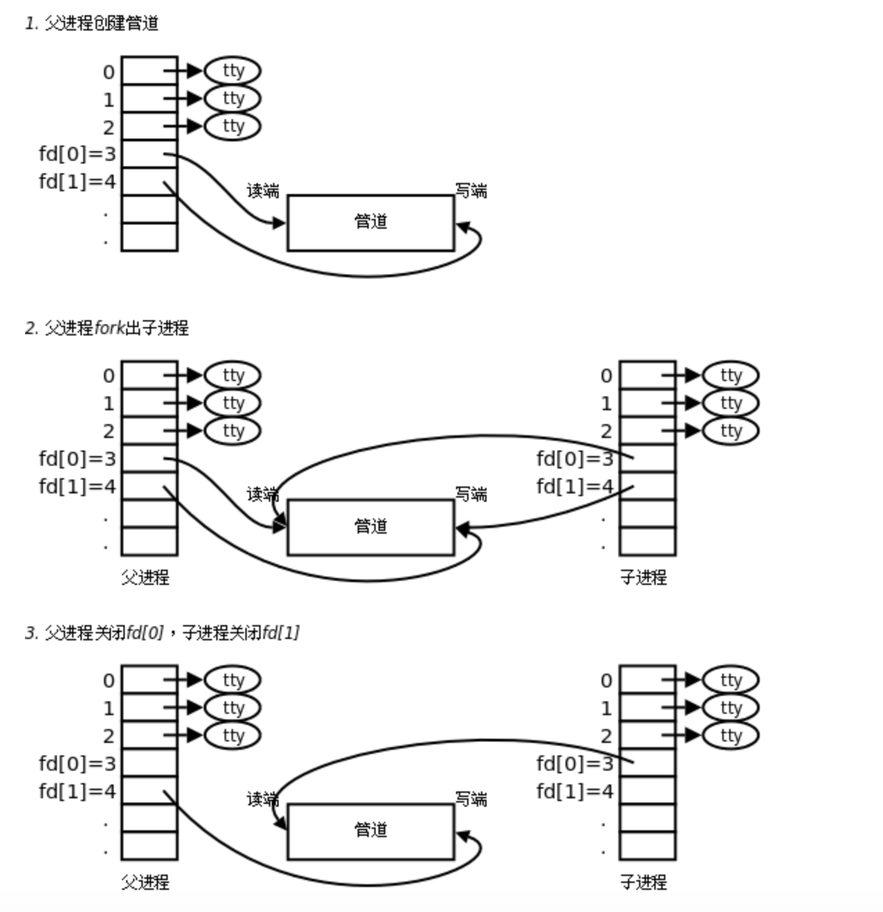
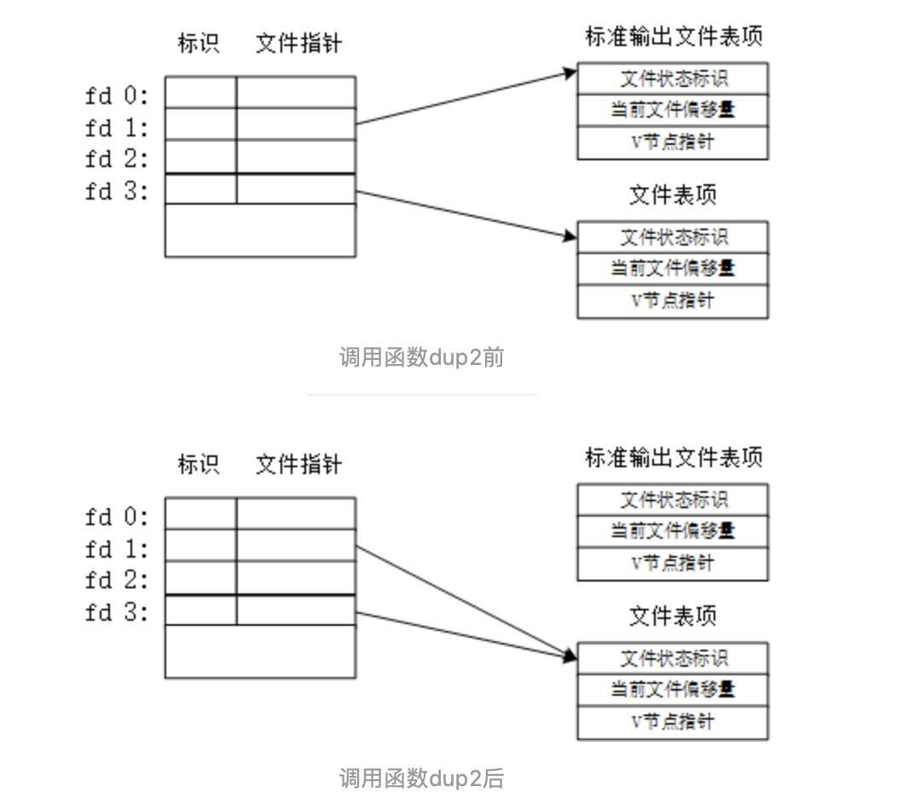
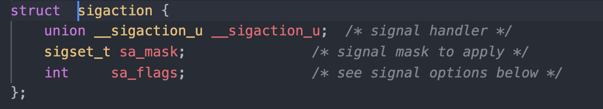
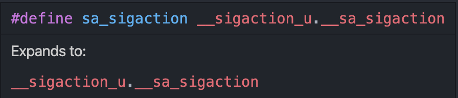
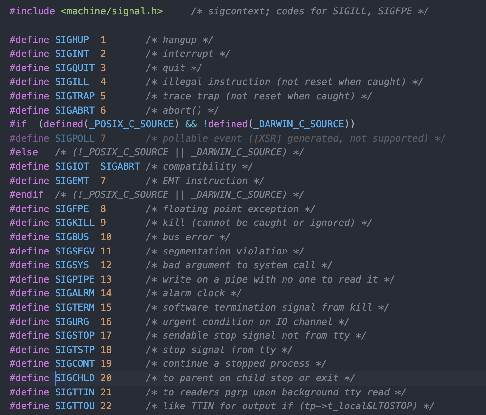
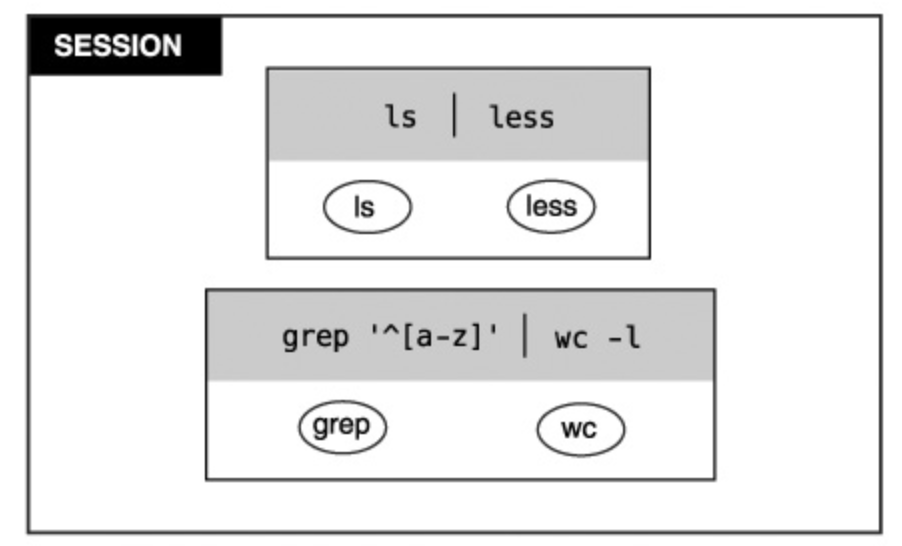
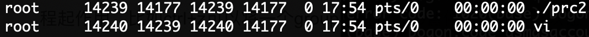

# lab2总结
[TOC]

## fork 与实验预备知识

在编译fork()时，发出了warning。通过使用man命令，发现

- fork()和exec函数族包含于<unistd.h>中
- exit()包含于<stdlib.h>中
- wait()和waitpid()包含于<sys/wait.h>中

sys/wait.h在哪儿呢？在/usr/include中发现了wait.h，但是里面只有一行`#include <sys/wait.h>`，这不是我自己包含我自己吗？

`echo "#include <sys/wait.h>" | gcc -E -x c - | grep /wait.h`使用该命令可以查看编译器在哪儿查找的。

发现是在`/usr/include/x86_64-linux-gnu/sys/wait.h`中。

waitpid()需要两个头文件<sys/wait.h>和<sys/types.h>，其中types.h定义了返回值pid_t，其实就是一个int，不包含他编译也能通过。

这里有头文件的说明[文档](https://pubs.opengroup.org/onlinepubs/9699919799/basedefs/contents.html)。


## pipe

### 程序过程



### more命令

Linux more 命令类似 cat ，不过会以一页一页的形式显示，更方便使用者逐页阅读，而最基本的指令就是按空白键（space）就往下一页显示。

### int pipe(int pipefd[2]) 

int pipe(int pipefd[2])  ,sucess 0,fail -1 set errno



这个程序创建了两个子进程，他们用管道进行通信，一个(pid[0])写入ls -l命令的数据，一个(pid[1])通过more命令来写出

### dup&dup2

`int dup2(int oldfd, int newfd);`有什么用呢？

- `dup2`可以用参数`newfd`指定新文件描述符的数值。若参数`newfd`已经被程序使用，则系统就会将`newfd`所指的文件关闭，若`newfd`等于`oldfd`，则返回`newfd`,而不关闭`newfd`所指的文件。

- 疑惑出在这句话：如果fd2已经打开，则先将其关闭。
  关闭什么，应该是关闭fd2和之前文件表项之间的映射关系，然后再让fd2和fd指向同一个文件表项。

举个例子，我让fd2的值取STDOUT_FILENO，然后使用printf()输出fd2的值，会发生什么

```c
#include "apue.h"
#include <fcntl.h>
#include <unistd.h>

int main(void)
{
    int fd, temp;
    fd = open("./test.txt", O_RDWR);
    temp = dup2(fd, STDOUT_FILENO);
    printf("fd = %d, temp = %d", fd, temp);
    return 0;
}
```

执行后，会发现printf()将内容输出到了文件test.txt里面，而不是输出到了显示器。本来STDOUT_FILENO是作为标准输出和显示器绑定的，现在调用函数dup2，会先解除它们之间的映射关系，然后让STEOUT_FILENO与文件描述符fd指向的文件表项建立映射关系。



`int dup(int oldfd);`

- dup用来复制参数oldfd所指的文件描述符。当复制成功是，返回最小的尚未被使用过的文件描述符，若有错误则返回-1.错误代码存入errno中返回的新文件描述符和参数oldfd指向同一个文件，这两个描述符共享同一个数据结构，共享所有的锁定，读写指针和各项全现或标志位。
- 调用dup(oldfd)等效于  `fcntl(oldfd, F_DUPFD, 0)`

https://blog.csdn.net/qq_42914528/article/details/82023408

### 管道和重定向的区别

**管道：**“|”，是将前一个命令的输出（stdout）作为后一个命令的输入(stdin)

左边的命令应该有标准输出 | 右边的命令应该接受标准输入

**重定向：**">"或者"<"，重定向是直接把输出转到文件去，重定向符号后面接文件

### 文件描述符

[Linux中的文件描述符与打开文件之间的关系](https://blog.csdn.net/cywosp/article/details/38965239?depth_1-utm_source=distribute.pc_relevant.none-task-blog-BlogCommendFromBaidu-1&utm_source=distribute.pc_relevant.none-task-blog-BlogCommendFromBaidu-1)


## singal

```c
void (*signal(int sig, void (*func)(int)))(int)
```

### 这个函数声明有点看不太懂？

- 后面附带的两个(int)的意思是：该符号前的函数指针所对应的函数是带一个int类型的参数的。

  比如最外面的，是说signal返回的函数指针所对应的函数是带int的参数的；里面的，作为参数的函数名是带一个int参数的。

- **中间部分：**`signal( int sig, void (*func)(int))`

  signal函数有2个参数，第一个是int，第二个是无返回值，带一个int参数的函数指针

- **外围：**`void   (*signal(xxx))   (int)`

  signal函数返回的是一个函数指针，无返回值，有一个int参数 

  void  (*xxx) (int)

  (arg,hander)传递给signal函数，signal函数经过处理，返回一个函数指针

  指针指向的这个函数有一个参数为（int）类型，它的返回值为void 类型，这就是我们的hander函数

- **简化：**

  ```c
  typedef void Sigfunc(int)
  //Sigfunc就代表的就是一个 返回值是一个无返回值，有一个int参数的函数。
  //最后就成了这样:
  Sigfunc *signal(int, Sigfunc*)
  ```

- 例程

  ```c
  #include <stdio.h>
  #include <unistd.h>
  #include <stdlib.h>
  #include <signal.h>
  
  void sighandler(int);
  
  int main()
  {
     signal(SIGINT, sighandler);
  
     while(1) 
     {
        printf("开始休眠一秒钟...\n");
        sleep(1);
     }
  
     return(0);
  }
  
  void sighandler(int signum)
  {
     printf("捕获信号 %d，跳出...\n", signum);
     exit(1);
  }
  ```

  ```c
  /*
  int (*f(void))(int){//f是函数，没有参数，返回指向一个内函数的指针；这个被指向的函数有一个int型形参，且返回一个int值
  
      return fun;//fun是个函数名，必须具备一个int形参、返回int值的要求
  
  }
  */
  #include "stdio.h"
  int fun(int n){
      printf("abcdef\n");
      return n;
  }
  int (*f(void))(int){
      return fun;
  }
  int main(void){
      printf("%d\n",f()(100));//调用函数f，通过f返回的指针用100调用函数fun
      return 0;
  }
  
  /*
  abcdef
  100
  */
  ```


### struct sigaction

通过查看`signal.h`可以发现各属性



### 为什么程序里有sa_sigaction呢




### signal mask

在POSIX下，每个进程有一个信号掩码(signal mask)。简单地说，信号掩码是一个“位图”，其中每一位都对应着一种信号。如果位图中的某一位为1，就表示在执行当前信号的处理程序期间相应的信号暂时被“屏蔽”，使得在执行的过程中不会嵌套地响应那种信号。


### sigfillset()

sigfillset()用来将参数set信号集初始化，然后把所有的信号加入到此信号集里即将所有的信号标志位置为1，屏蔽所有的信号。


### SA_SIGINFO

当设定了该标志位时，表示信号附带的参数可以被传递到信号处理函数中

```c
#define SA_SIGINFO      0x0040  /* signal handler with SA_SIGINFO args */
```


### sigaction

**sigaction函数的功能是检查或修改与指定信号相关联的处理动作（可同时两种操作）**

```c
int sigaction(int signum, const struct sigaction *act,
                     struct sigaction *oldact);
```

signum参数指出要捕获的信号类型，act参数指定新的信号处理方式，oldact参数输出先前信号的处理方式（如果不为NULL的话）。


### SIGCHLD

通过查看`signal.h`我们可以可以看到`SIGCHLD`的作用是传递给父进程子进程结束或者退出的信息。



### WNOHANG

**WNOHANG** **表示如果没有子进程退出，就不等待**


## process

### [进程，进程组，会话关系](https://www.cnblogs.com/zengyiwen/p/5755191.html)

进程组是一组相关进程的集合，会话是一组相关进程组的集合。

进程组和会话是为了支持shell作业控制而引入的概念。

当有新的用户登录Linux时，登录进程会为这个用户创建一个会话。用户的登录shell就是会话的首进程。会话的首进程ID会作为整个会话的ID。会话是一个或多个进程组的集合，囊括了登录用户的所有活动。

在登录shell时，用户可能会使用管道，让多个进程互相配合完成一项工作，这一组进程属于同一个进程组。 



`ps aux`查看所有进程, `ps -ejH`查看进程组

### 进程组

每一个进程都属于一个“进程组”，当一个进程被创建的时候，它默认是其父进程所在组的成员。传统上，一个进程的组ID（**pgid**）等于这个组的第一个成员（也称为*进程组领导*）。

- 进程组分为前台、后台进程组：前台进程组中的进程可以访问标准输入输出，shell被分配到会话的前台进程组中；后台进程组不能进行终端的I/O操作。

`ps j` 获取进程的PPID (父进程ID), PID (本进程 ID), PGID (进程组 ID) and SID (会话 ID)。

- 每一个会话最多有一个进程组是“前台进程组”，控制终端会将输入和[信号](http://man7.org/linux/man-pages/man7/signal.7.html)传给该进程组的成员（例如你在终端按下Ctrl+C就会向前台进程组发送SIGINT信号）。

- `tcgetpgrp(fd)`获取所在会话的前台进程组ID,其中`fd`对应会话的控制终端的文件描述符
- 通过`tcsetpgrp(fd,pgrp)`设置所在会话的前台进程组，其中`fd`对应会话的控制终端的文件描述符， `pgrp`是这个会话中的一个进程组。


### int setpgid(pid_t pid,pid_t pgid);

将pid进程的进程组ID设置成pgid，创建一个新进程组或加入一个已存在的进程组

性质1：一个进程只能为自己或子进程设置进程组ID，不能设置其父进程的进程组ID。

性质2：if(pid == pgid), 由pid指定的进程变成进程组长;即进程pid的进程组ID pgid=pid.

性质3：if(pid==0),将当前进程的pid作为进程组ID.

setpgid(getpid(), pgid)

性质4：if(pgid==0),将pid作为进程组ID.


### pid_t tcgetpgrp( int filedes );
返回值：若成功则返回前台进程组的进程组ID，若出错则返回-1


### int tcsetpgrp( int filedes, pid_t pgrpid );
- 返回值：若成功则返回0，若出错则返回-1

- 将前台进程组ID设置pgid_id，fildes是与控制终端（标准输入、输出、错误输出）相联系的文件描述符，使用该函数可以把一个进程组成为前台进程组，使其与控制终端保持联系。

- 例子

  ```c
      /* 使子进程所在的进程组成为前台进程组，然后执行vi */
      setpgid(0,0);
      tcsetpgrp(0,getpid());
      execl("/usr/bin/vi","vi",NULL);
  ```

  

### 坑

vi在/usr/bin中，不能只有/bin

在运行父进程的时候，需要用fg调到前台

`ps -efj`

​                           pid             ppid		pgid			sid




