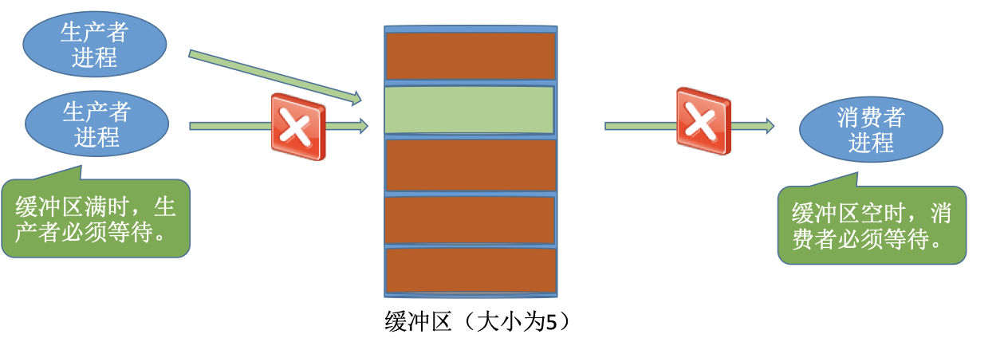
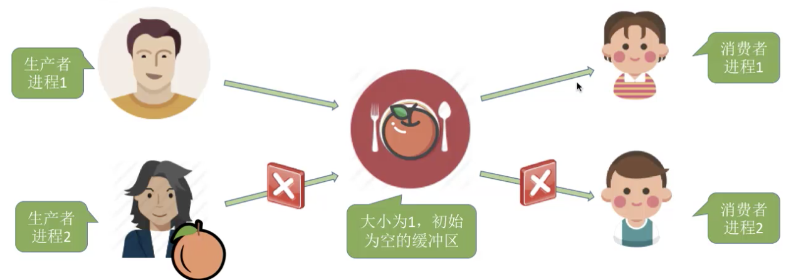
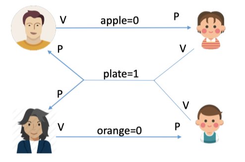

# producer–consumer problem

## 零、核心问题

生产者消费者的核心问题是什么呢？其实是如何解决同步的问题。

在这个问题中，

系统中有一组生产者和一组消费者进程，生产者进程每次生产一个产品放入缓冲区，消费者进程每次从缓冲区中取出一个产品并使用。

- 1.生产者、消费者共享一个初始为空、大小为n的缓冲区。

- 2.只有缓冲区没满时，生产者才能从中取出产品，否则必须等待。

- 3.只有缓冲区不空时，消费者才能从中取出产品，否则必须等待。

- 4.缓冲区是临界资源，各进程必须互斥地访问。



### 1.关系分析

找出题目中描述的各个进程，分析它们之间的同步、互斥关系。

两类进程：生产者进程、消费者进程

互斥关系：互斥访问临界资源。

同步关系：生产者-消费者。

### 2.整理思路

根据各进程的操作流程确定P、V操作的大致顺序。

生产者每次要消耗（P）一个空闲缓冲区，并生产（V）一个产品，

消费者每次要消耗（P）一个产品，并释放一个空闲缓冲区（V），

往缓冲区放入/取走产品需要互斥。

### 3.设置信号量

根据题目条件确定信号量初值。（互斥信号量初值一般为1，同步信号量的初始值要看对应资源的初始值是多少）

```c
semaphore mutex = 1;	//互斥信号量，实现对缓冲区的互斥访问
semaphore empty = n;	//同步信号量，表示空闲缓冲区的数量
semaphore full = 0;		//同步信号量，表示产品的数量，也即非空缓冲区的数量
```

## 一、实现

```c
producer(){
  while(1){
    produce();
    P(empty);		//消耗一个空闲缓冲区 (1)
    P(mutex);		//(2)
    put();
    V(mutex);
    V(full);		//增加一个产品
  }
  										consumer(){
                        while(1){
                          P(full);		//消耗一个产品（非空闲缓冲区）(3)
                          P(mutex);		//(4)
                          get();
                          V(mutex);
                          V(empty);		//增加一个空闲缓冲区
                          consume();
                        }
                      }
}
```

思考：

- 能够改变相邻P、V操作的顺序？

  - 不能，这样会发生死锁现象。

  - <font color = #af0000>实现互斥的P操作一定要在实现同步的P操作之后</font>

  - V操作顺序可以随意交换。

- 那么非临界区可否放入临界区？

  - 可以，但没必要
  - 会导致进程间并发度降低

## 二、多生产者-多消费者问题

桌子上有一只盘子，每次只能向其中放入一个水果。爸爸专向盘子中放苹果，妈妈专向盘子中放 橘子，儿子专等着吃盘子中的橘子，女儿专等着吃盘子中的苹果。只有盘子空时，爸爸或妈妈才 可向盘子中放一个水果。仅当盘子中有自己需要的水果时，儿子或女儿可以从盘子中取出水果。 用PV操作实现上述过程。

这个问题和上个问题的区别是，生产者和消费者所对应的产品的类别不同。

多生产者-多消费者，这里的多不是指数量的多，而是指类别的多少。

### 1.关系分析



找出题目中描述的各个进程，分析它们之间的同步、互斥关系

互斥关系(mutex=1)：

​	对缓冲区（盘子）的访问要互斥进行

同步关系（一前一后）：

​	1.父亲将苹果放入盘子后，女儿才能取苹果

​	2.母亲将橘子放入盘子后，儿子才能取橘子

​	3.只有<font color =#af0000>盘子为空</font>时，父亲或者母亲才能放入水果

<font color = #00af00>"盘子为空"</font>这个事件可以由俄儿子或者女儿触发，事件发生后才允许父亲或者母亲放水果



### 2.整理思路

根据各进程的操作流程确定P、V操作的大致顺序。

互斥：在临界区前后分别PV

同步：前V后P

### 3.设置信号量

如何实现

```c
semaphore mutex = 1;	//实现互斥访问盘子（缓冲区）
semaphore apple = 1;	//盘子中有几个苹果
semaphore orange = 1;	//盘子中有几个橘子
semaphore plate = 1;	//盘子中还可以放多少个水果
dad(){								mom(){							daughter(){						son(){
  while(1){							while(1){					  while(1){							while(1){
    prepareApple();				prepareOrange();    P(apple);							P(orange);
    P(plate);							P(plate);						P(mutex);							P(mutex);
    P(mutex);							P(mutex);						get()									get();
    put();								put();							V(mutex)							V(mutex);
    P(mutex);							P(mutex);						V(plate);							P(plate);
    V(apple);							V(apple);						consumeApple();				consumeOrange();
  }											}										}											}
}											}										}											}
```

问题：可不可以不同互斥信号量

```c
semaphore apple = 1;	//盘子中有几个苹果
semaphore orange = 1;	//盘子中有几个橘子
semaphore plate = 1;	//盘子中还可以放多少个水果
dad(){								mom(){							daughter(){						son(){
  while(1){							while(1){					  while(1){							while(1){
    prepareApple();				prepareOrange();    P(apple);							P(orange);
    P(mutex);							P(mutex);						get()									get();
    put();								put();							V(mutex)							V(mutex);
    V(apple);							V(apple);						consumeApple();				consumeOrange();
  }											}										}											}
}											}										}											}
```

- 结论：即使不设置专门 的互斥变量mutex，也不 问题：可不可以不 会出现多个进程同时访 用互斥信号量？ 问盘子的现象

- 原因在于：本题中的缓冲区大小为1，在任何时刻，apple、orange、plate三个同步信号量中最多只有一个是1，因此在任何时刻，最多只有一个进程的P操作不会被阻塞，并顺利地进入临界区

- 盘子容量为2的话，可能产生数据覆盖的问题。

## 二、总结

在分析同步问题（一前一后问题）的时候不能从单个进程行为的角度来分析，要把“一前一后”发生的事看做是两种“事件”的前后关系。

正确的分析方法应该从“事件”的角度来考虑，我们可以把上述四对“进程行为的前后关系”抽象为 一对“事件的前后关系”

盘子变空事件->放入水果事件。“盘子变空事件”既可由儿子引发，也可由女儿引发；“放水果事件” 既可能是父亲执行，也可能是母亲执行。这样的话，就可以用一个同步信号量解决问题了