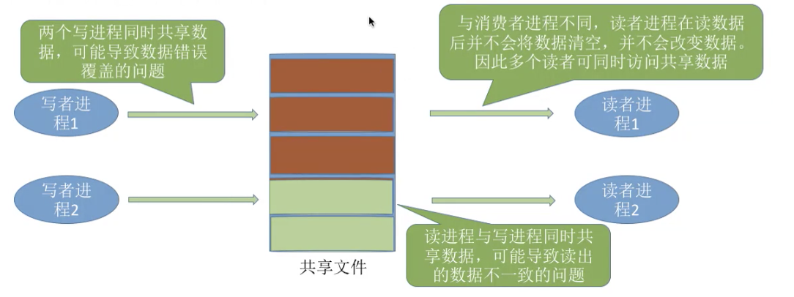

# readers–writers problem

## 零、核心问题

读者写者的核心问题是什么呢？其实是如何解决互斥的问题。

在这个问题中，

- 有读者和写者两组并发进程，共享一个文件，

- 当两个或两个以上的读进程同时访问共享数据时不会产生副作用，
- 但当某个写进程和其他进程（读进程或者写进程）同时访问共享数据时则可能导致数据不一致的错误，
- 因此要求
  - 1.允许多个读者同时对文件执行读操作
  - 2.只允许一个写者往文件中写信息
  - 3.任一写者在完成操作前不允许其他读者或者写者工作
  - 4.写者执行写操作前，应让已有的读者和写者完全退出



### 1.关系分析

找出题目中描述的各个进程，分析它们之间的同步、互斥关系。

两类进程：写进程、读进程

互斥关系：写-写，写-读，读-读之间不存在互斥问题

读者写者问题可以有两种实现方式。

### 2.整理思路

根据各进程的操作流程确定P、V操作的大致顺序

写者进程和任何进程都要互斥，因此要设置一个互斥信号量rw，在写者访问共享文件前后分别执行P、V操作。

读者进程和写者进程也要互斥，因此读者访问共享文件前后也要对rw执行P、V操作。

如果所有读者进程在访问共享文件之前都要执行P（rw）操作，那么会导致各个进程之间也无法同时访问文件。

<font color = #af0000>key：读者写者的核心思想--怎么处理该问题？</font>

### 3.设置信号量。

设置需要的信号量，并根据题目条件确定信号量初值。（互斥信号量一般初值为1，同步信号量的初始值要看对应资源的初始值时多少）

P（rw）和V（rw）其实就是对共享文件的“加锁”和“解锁”。既然各个进程需要同时访问，而读进程与写进程又必须互斥访问，那么我们可以让第一个访问文件的读进程“加锁”，让最后一个访问完文件的读进程“解锁”。可以蛇追一个整数变量count来记录当前有几个读进程在访问文件。

## 一、读者优先

```c
semaphore rw = 1;				//用于实现对文件的互斥访问，表示当前是否有进程在访问共享文件
int count = 0;					//记录当前有几个读进程在访问文件

writer(){
  while(1){
    P(rw);	//写之前"加锁"
    写文件...
    V(rw);	//写之后"解锁"
  }
}
															reader(){
                                while(1){
                                  if(count==0)
                                    P(rw);		//第一个读进程负责"加锁"
                                  count++;		//访问文件的进程数+1
                                  读文件...
                                  count--;		//访问文件的进程数-1
                                  if(count==0)
                                    V(rw);		//最后一个读进程负责"解锁"
                                    
                                }
                              }

```

以上进程有问题吗？

思考：若两个读进程并发执行，则两个读进程有可能先后执行P（rw），从而使第二个读进程阻塞。

如何解决：出现上述问题的原因在于<font color = #ff000>对count变量的检查和赋值无法一气呵成</font>，因此可以设置另一个互斥信号量来保证各读进程对count的访问是互斥的。

```c
semaphore mutex = 1;		//用于保证对count变量的互斥访问
													reader(){
                                while(1){
                                	P(mutex);		//各读进程互斥访问count
                                  if(count==0)
                                    P(rw);		//第一个读进程负责"加锁"
                                  count++;		//访问文件的进程数+1
                                  V(mutex);
                                  读文件...
                                  P(mutext);
                                  count--;		//访问文件的进程数-1
                                  if(count==0)
                                    V(rw);		//最后一个读进程负责"解锁"
                                  V(mutex);
                                    
                                }
                              }
```

潜在的问题：只要有读进程还在读，写进程就要一直阻塞等待，可能“饿死”。

因此在这种算法中，读进程是优先的。

下面代码表达的是同一个意思。


```c
rmutex,wmutex:semaphore
rmutex :=1;wmutex :=1;
rcount:int
rcount:=0;
	//读者R									//写者W
  Wait(rmutex);						Wait(wmutex);
  rcount++;								Write_Action();
  if(rcount == 1)					Signal(wmutex);
  Wait(wmutex);
  Signal(rmutex);
  Read_Action();
  Wait(rmutex);
  rcount--;
  if(rcount == 0)
  Signal(wmutex);
  Signal(rmutex);
```

[读者优先代码](./刘璐/WK8-9/readerFirst.c)

## 二、写者优先

其实写者优先并不是说写者进程发出写的请求时，就要不顾之前的读者进程，让写者进程插队。而是直到前面所有的读者进程都完成后，再进行写过程。

这里的写者优先其实是FCFS，或者说是一种读写者公平策略（读写公平法）。

添加一个信号量 <font color = #af0000#>w</font>，用于实现“写优先”

```c
semaphore rw = 1;				//用于实现对文件的互斥访问，表示当前是否有进程在访问共享文件
int count = 0;					//记录当前有几个读进程在访问文件
semaphore mutex = 1;		//用于保证对count变量的互斥访问
semaphore w = 1;				//用于实现"写者优先"

writer(){
  while(1){
    P(w);
    P(rw);	//写之前"加锁"
    写文件...
    V(rw);	//写之后"解锁"
    V(w);
  }
}
													reader(){
                                while(1){
                                  P(w);
                                	P(mutex);		//各读进程互斥访问count
                                  if(count==0)
                                    P(rw);		//第一个读进程负责"加锁"
                                  count++;		//访问文件的进程数+1
                                  V(mutex);
                                  V(w);
                                  读文件...
                                  P(mutex);
                                  count--;		//访问文件的进程数-1
                                  if(count==0)
                                    V(rw);		//最后一个读进程负责"解锁"
                                  V(mutex);                
                                }
                              }
```

分析一下并发执行P(w)的情况：

- 读者1->写者2
- 写者1->读者2
- 写者1->读者1
- 读者1->写者1->读者2
- 写者1->读者1->写者2

[写者优先代码](./刘璐/WK8-9/rwFair.c)

## 三、总结

读者-写者问题为我们解决复杂的互斥问题提供了一个参考思路。

- 其核心思想在于设置了一个计数器count用来记录当前正在访问共享文件的读进程数。我们可以用count的值来判断当前进入的进程是否是第一个/最后一个读进程，从而做出不同的判断。

- 对count变量的检查和赋值不能一气呵成导致了一些错误，如果需要实现“一气呵成”，自然应该想到用互斥信号量。
- 如何解决“写进程饥饿”问题。